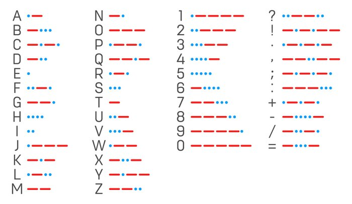
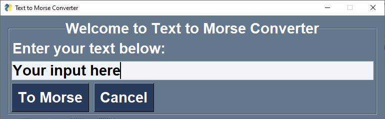
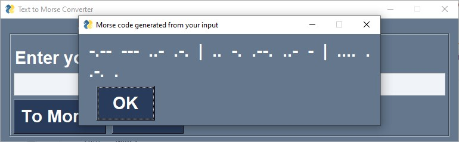

# Text to Morse Converter
Welcome to **Text to Morse Converter**!

Morse code is used in telecommunication to encode text characters as standardized sequences of two different signal durations, called dots and dashes.

Reference the image below to see how each character is encoded as Morse code:

Luckily, you don't have to remember all of this. I have created a converter to convert your input text into Morse code. Simply run `main.py` file, a GUI window will show up asking for you text:

Press **To Morse** button to see the result in a popup window:

In the resulting Morse code, each sequence represents a character in your **input text** and is separated by **2 white spaces**. Each word in your **input text** is separated by the **|** character.
